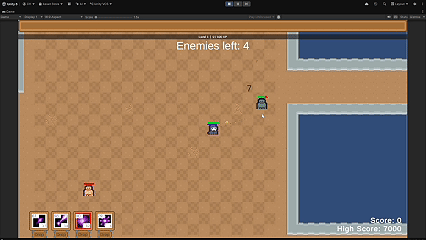
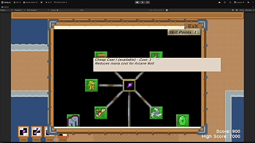

# Dungeon Roguelike (Unity, C#)

> Source code is private per UCSC course policy. This repo showcases the project; happy to walk through the systems in an interview.

Defeat enemy waves to unlock new spells and relics and upgrade your stats. Built by a team of 4 in UCSC CMPM 121 (2026).

## Features
3 player classes, 6 enemy types, 13 relics, 4 spell types, and 16 spell modifiers, with status effects, damage and armor types, RPG stats, a skill tree, and an enemy spawner driven by JSON. Relics are conditional buffs, e.g. "gain 10 mana after standing still for 5 seconds."

## My role
- **Spell-casting and projectile system:** a spell's hit builds a `Damage` (amount, damage type, critical flag); the target applies its resistances and raises a damage event that drives floating damage numbers, with crits shown in red/yellow
- **Skill tree:** a center node unlocks a new spell; surrounding nodes grant spell modifiers or relics. A builder assembles spell, modifier and relic nodes, and a node can be unlocked once its parent is unlocked and you have the skill points, adding it to the player's spells or relics
- **JSON-driven architecture:** content and enemy waves defined in data, so we could tune and add content without code changes

## What I learned
Working in a large shared codebase, and why clean interfaces and data-driven design made adding content fast.

## Team
Jay Reddy, Nikolas Huang, Aaron Yam, and Colin Huang
